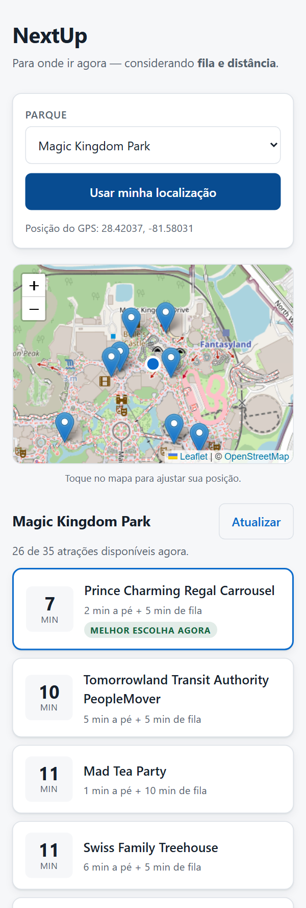

# NextUp 🎢

**Para qual atração eu devo ir agora?**

NextUp responde essa pergunta em tempo real, cruzando o tempo de fila de cada atração com
a distância que você precisa percorrer até ela — e devolve a que custa menos tempo do seu
dia.

### 👉 [Abrir o NextUp](https://nextup-rcux.onrender.com) · [Documentação da API](https://nextup-rcux.onrender.com/docs)

> Dados ao vivo de parques reais. Sem GPS por perto? **Toque no mapa** para escolher uma
> posição dentro do parque.
>
> *Roda no plano gratuito do Render, que hiberna sem acesso. Um agendamento do GitHub
> Actions chama `/api/health` a cada 10 minutos para manter o serviço acordado — mas se
> ele tiver dormido, a primeira visita leva até um minuto.*

[](https://github.com/GabrielFDA7/nextup/actions/workflows/ci.yml)


<p align="center">
  
</p>

> Repare no terceiro colocado da lista: **Mad Tea Party está a 1 minuto a pé** — a atração
> mais próxima de todas — e mesmo assim perde para duas que ficam mais longe. É o
> algoritmo funcionando: 1 minuto de caminhada + 10 de fila custa mais que 2 + 5.

---

## O problema

Visitantes de parques como Walt Disney World gastam boa parte do dia em filas. Os tempos
de espera são voláteis: uma atração com 90 minutos às 11h pode cair para 15 às 11h40,
porque um show terminou do outro lado do parque e a multidão migrou.

Hoje existe um serviço informal para contornar isso: um consultor monitora um site de
filas e avisa o cliente por WhatsApp — *"corre pro Space Mountain, caiu pra 20 minutos"*.

É um humano executando, em tempo real, um algoritmo. **NextUp é esse algoritmo.**

## O diferencial

A pergunta óbvia seria "qual atração tem a menor fila?" — e ela leva à decisão errada.

> A menor fila do parque está com 5 minutos, mas fica a 900 metros de onde você está.
> Você caminha 15 minutos para economizar 10. Perdeu tempo.

NextUp responde a pergunta certa: **qual atração me custa menos tempo até eu estar sentado
no brinquedo?**

```
custo_total = tempo_de_caminhada + tempo_de_fila
```

É isso que o consultor humano faz de cabeça sem perceber — e é o que separa o NextUp de
um site de tempos de espera comum.

## Como funciona

```
Você (GPS do navegador)
        │
        ▼
   API FastAPI  ──▶  Cache  ──(expirado)──▶  ThemeParks.wiki
        │              │
        │         (válido)
        ▼              │
   Normalização ◀──────┘
        │
        ▼
   Motor de Ranking   ◀── Haversine + filtros + custo total
        │
        ▼
   As melhores atrações, com a justificativa de cada uma
```

Antes de qualquer cálculo, são descartadas as atrações fechadas, em manutenção, quebradas
— e também as que estão **abertas mas não informam fila**. Essa última categoria existe e
surpreende: o Castelo da Cinderela está `OPERATING` e não é brinquedo. No Magic Kingdom,
9 das 35 atrações caem nesse caso.

O resultado vem com explicação legível — *"4 min de caminhada + 20 min de fila = 24 min"* —
porque uma recomendação sem motivo não gera confiança.

## Stack

| Camada | Tecnologia |
|---|---|
| Backend | Python 3.11+, FastAPI, httpx, Pydantic v2 |
| Frontend | HTML, CSS e JavaScript puro + Leaflet |
| Testes | pytest, respx, Playwright |
| Qualidade | ruff |
| Infra | Docker, GitHub Actions |

Fonte de dados: [ThemeParks.wiki](https://themeparks.wiki) — API pública e gratuita.

**Por que o frontend não usa framework:** a tela é uma lista ordenada e um mapa. React
aqui acrescentaria etapa de build, dependências e complexidade de deploy sem melhorar o
produto — e o código continua legível em dois minutos por quem abre o repositório.

## Rodando

### Com Docker

```bash
docker compose up --build
```

Abrir <http://localhost:8000>. A API e a interface sobem juntas, num contêiner só.

### Sem Docker

```bash
git clone https://github.com/GabrielFDA7/nextup.git
cd nextup

python -m venv .venv
source .venv/bin/activate       # Windows: .venv\Scripts\activate
pip install -e ".[dev]"

uvicorn nextup.api.main:app --reload
```

Documentação interativa da API em <http://localhost:8000/docs>.

### Pela linha de comando

```bash
nextup --parks                                  # lista os IDs de parque
nextup                                          # filas do Magic Kingdom, ordenadas
nextup --lat 28.42037 --lon -81.58031           # para onde ir, considerando a distância
```

## A API

| Rota | Devolve |
|---|---|
| `GET /api/health` | Estado do serviço. Não consulta a fonte externa, de propósito |
| `GET /api/destinations` | Destinos e parques, com os IDs usados nas outras rotas |
| `GET /api/parks/{id}/recommendations?lat&lon&limit` | O ranking, com a conta aberta de cada atração |

```jsonc
// GET /api/parks/75ea578a-.../recommendations?lat=28.42037&lon=-81.58031&limit=1
{
  "park_name": "Magic Kingdom Park",
  "total_attractions": 35,
  "available": 26,
  "data_updated_at": "2026-09-12T18:43:55Z",
  "recommendations": [
    {
      "attraction": { "name": "Mad Tea Party", "latitude": 28.42, "longitude": -81.579 },
      "walking_minutes": 1.2,
      "queue_minutes": 5,
      "total_minutes": 6.2,
      "explanation": "Mad Tea Party — 1 min de caminhada + 5 min de fila = 6 min"
    }
  ]
}
```

## Testes

```bash
pytest -m "not e2e"     # 173 testes, ~7s — o ciclo rápido
pytest                  # tudo, incluindo interface em navegador real
ruff check . && ruff format --check .
```

**194 testes, e nenhum deles toca a internet.** As respostas reais da ThemeParks.wiki
foram capturadas em `tests/fixtures/` e são devolvidas pelo `respx`, o que torna possível
testar o que a API real nunca entregaria sob demanda: erro 503, conexão derrubada no meio
da requisição, contrato de dados alterado.

Três garantias que os testes protegem e valem destaque:

- **A tese do produto.** `test_fila_menor_perde_para_atracao_mais_perto` trava a regra
  central: fila de 10 min a 900 m perde para fila de 20 min a 50 m. Se alguém
  "simplificar" o algoritmo para ordenar por `waitTime`, esse teste acusa.
- **A arquitetura.** `test_arquitetura.py` lê o código-fonte e falha se algum módulo de
  `core/` importar `httpx`, `asyncio` ou `clients/`. A regra de dependência não vive só na
  documentação.
- **A interface.** 21 testes em Chromium verificam o que nenhum teste de API alcança: que
  o mapa carrega, que negar o GPS não quebra o app e que a tela não rola de lado no
  celular.

Para rodar os de interface:

```bash
pip install -e ".[dev,e2e]"
playwright install chromium
pytest -m e2e
```

## Estrutura do projeto

```
src/nextup/
├── clients/    # Conversa com a ThemeParks.wiki (HTTP + cache)
├── models/     # Os dados já validados e tipados
├── core/       # Regra de negócio: distância, score, ranking — sem rede
└── api/        # Exposição HTTP
web/            # Interface do usuário
tests/          # Testes automatizados
```

As camadas dependem em **sentido único**: `api → core → models ← clients`.

O `core/` é o cérebro e não importa nada de rede, então seus testes rodam offline em
milissegundos. O `clients/` é o único lugar que sabe que a ThemeParks.wiki existe — trocar
a fonte de dados afeta só essa pasta.

## Roadmap

- [x] **Fase 0** — Fundação: repositório, estrutura, qualidade, CI
- [x] **Fase 1** — Cliente da API com cache, backoff exponencial e tratamento de falhas
- [x] **Fase 2** — Motor de recomendação por custo total
- [x] **Fase 3** — API HTTP com documentação automática
- [x] **Fase 4** — Interface web com mapa e geolocalização
- [x] **Fase 5** — Docker e deploy público
- [ ] **Fase 6** — Histórico de filas, tendências e previsão

Contexto completo, decisões técnicas e detalhes de arquitetura em
[docs/PROJETO.md](docs/PROJETO.md).

## Licença

[MIT](LICENSE).

---

> **Aviso:** projeto pessoal e educacional, sem qualquer vínculo, patrocínio ou aprovação
> da The Walt Disney Company ou de qualquer operador de parque. Consome exclusivamente
> dados públicos da ThemeParks.wiki.
